<!-- ─────────────────────────  TERMINAL  ───────────────────────── -->

  

<!-- ─────────────────────────  attached: writing (clickable)  ───────────────────────── -->

  
  

<!-- ─────────────────────────  attached: links  ───────────────────────── -->

  
  
  
  

<!-- ─────────────────────────  attached: stats  ───────────────────────── -->

  
  

  

